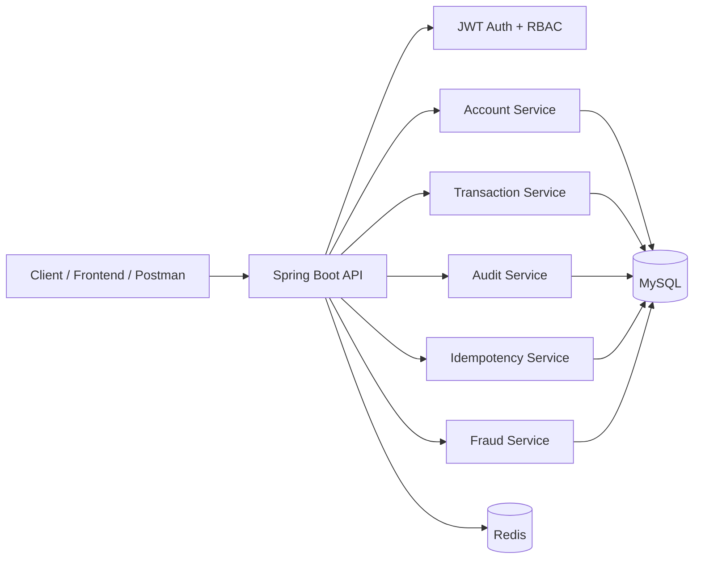
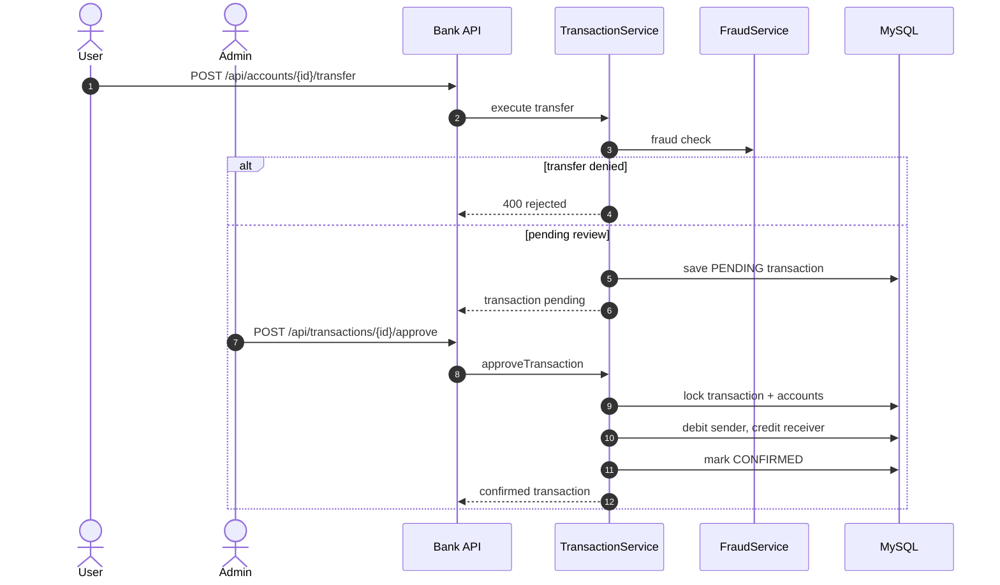
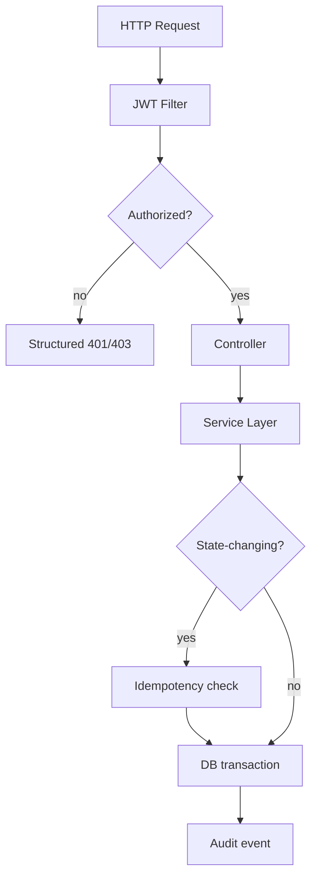

# Bank API

Production-oriented Spring Boot banking API with JWT authentication, role-based access control, idempotent money operations, fraud review, audit logging, and Flyway-managed schema migrations.

## Overview

This project is designed to demonstrate banking-grade backend engineering:

- JWT-secured authentication and authorization
- Account deposits, withdrawals, and transfers
- Fraud detection with pending transaction review
- Pessimistic locking for approval workflows
- Optimistic locking for account and transaction concurrency safety
- Idempotency keys for all state-changing money operations
- Append-only audit events for sensitive actions
- Swagger/OpenAPI documentation
- Docker, Docker Compose, CI, and Actuator health checks

## API Docs

- Swagger UI: `http://localhost:8080/swagger-ui/index.html`
- OpenAPI JSON: `http://localhost:8080/v3/api-docs`
- Health check: `http://localhost:8080/actuator/health`

JWT bearer auth is configured in the OpenAPI metadata, so authenticated endpoints can be exercised directly from Swagger UI.

## Architecture

### High-Level View



### Transfer Review Flow



### Request Boundary



## Tech Stack

- Java 21
- Spring Boot 3.3.2
- Spring Security + JWT
- Spring Data JPA / Hibernate
- MySQL 8
- Redis
- Flyway
- SpringDoc OpenAPI
- Maven

## Core Domain Rules

- Deposits, withdrawals, transfers, approvals, and rejections require an `X-Idempotency-Key` header.
- High-value transfers are flagged for fraud review and can remain `PENDING`.
- Admin approvals lock the transaction row and both account rows to prevent double-processing.
- Audit events are written separately from business transactions.
- Account and transaction entities use `@Version` for optimistic concurrency protection.

## Security Model

- Public routes: `GET /`, `POST /api/auth/register`, `POST /api/auth/login`, `GET /actuator/health`
- Admin routes: `/api/admin/**`, `/api/transactions/**`
- All other application routes require a valid JWT

Authorization header:

```http
Authorization: Bearer <token>
```

## Endpoints

### Auth

- `POST /api/auth/register`
- `POST /api/auth/login`

### Users

- `GET /api/users`
- `GET /api/users/{id}`
- `PUT /api/users/{id}`
- `POST /api/users/{id}/close`

### Accounts

- `GET /api/accounts`
- `GET /api/accounts/{id}`
- `POST /api/accounts`
- `PUT /api/accounts/{id}`
- `POST /api/accounts/{id}/close`
- `POST /api/accounts/{id}/deposit`
- `POST /api/accounts/{id}/withdraw`
- `POST /api/accounts/{id}/transfer`

### Transactions

- `GET /api/transactions?page=0&size=10&accountId=&status=&type=&fraud=`
- `POST /api/transactions/{id}/approve`
- `POST /api/transactions/{id}/reject`

### Admin

- `GET /api/admin/dashboard`
- `GET /api/admin/stats`

## Example Requests

### Register

```http
POST /api/auth/register
Content-Type: application/json

{
  "username": "omar",
  "email": "omar@example.com",
  "password": "password123"
}
```

### Login

```http
POST /api/auth/login
Content-Type: application/json

{
  "username": "omar",
  "password": "password123"
}
```

### Deposit

```http
POST /api/accounts/1/deposit
Authorization: Bearer <token>
X-Idempotency-Key: 4f1f2f4b-8f6d-4e46-8f8d-3dd3d56a4dd1
Content-Type: application/json

{
  "amount": 100.00
}
```

### Transfer

```http
POST /api/accounts/1/transfer
Authorization: Bearer <token>
X-Idempotency-Key: 7a6b0a5f-5db2-4cb1-9f58-4f36f97d9d2e
Content-Type: application/json

{
  "receiver": 2,
  "amount": 40.00
}
```

## Running Locally

### Maven

Windows:

```powershell
.\mvnw.cmd spring-boot:run
```

macOS/Linux:

```bash
./mvnw spring-boot:run
```

### Docker Compose

```bash
docker compose up --build
```

## Environment Variables

```properties
DB_URL=jdbc:mysql://localhost:3306/bank_api?useSSL=false&allowPublicKeyRetrieval=true&serverTimezone=UTC
DB_USERNAME=root
DB_PASSWORD=replace-with-your-password
PORT=8080
SERVER_ADDRESS=0.0.0.0
JWT_SECRET=replace-with-a-long-random-secret-at-least-32-chars
JWT_EXPIRATION_MS=86400000
FRAUD_AMOUNT_THRESHOLD=5000
REDIS_HOST=localhost
REDIS_PORT=6379
SPRING_PROFILES_ACTIVE=dev
```

`JWT_SECRET` should be a long, high-entropy value. Production should use a secret manager.

## Profiles

- `dev`: MySQL, SQL logging enabled, in-memory login rate limiting
- `prod`: MySQL, Redis-backed login rate limiting, schema validation only
- `test`: H2, in-memory login rate limiting, Redis health disabled

## Database

- Schema is managed with Flyway migrations
- Production uses `ddl-auto=validate`
- Accounts and transactions use version columns for optimistic locking
- Idempotency keys store request hashes, status, and cached responses

## Testing

```powershell
.\mvnw.cmd test
```

## Notes

- Swagger/OpenAPI is available without authentication for documentation browsing.
- Actuator health is exposed for Docker health checks and deployment probes.
- This project is built to show production-minded tradeoffs, not just CRUD endpoints.
